# Dokumentasi Hubungan Tabel dan Stored Procedures Aplikasi AAF

---

## 1. Pendahuluan

Dokumen ini menjelaskan hubungan antar tabel, stored procedures, dan Oracle views yang digunakan dalam aplikasi AAF (Actual Accrued & Freight). Dokumentasi ini disusun berdasarkan analisis file-file handler backend.

---

## 2. Arsitektur Database

### 2.1. Overview Database

```mermaid
flowchart TB
    subgraph MSSQL["🗄️ MS SQL Server"]
        subgraph SASKI["Database: SASKI"]
            MU["master.master_user"]
            MR["master.master_role"]
            MP["master.master_permission"]
            RPM["master.role_permission_map"]
        end

        subgraph APIHUB["Database: APIHUB"]
            AAF_H["AAF Headers<br/>(Accrued/Actual)"]
            AAF_D["AAF Details<br/>(Accrued/Actual)"]
            SP_AAF["Stored Procedures<br/>SP_APIHUB_ERPORACLE_*"]
        end

        subgraph APPROVAL["Database: APPROVAL"]
            UM["M_USER_MAPPING"]
        end
    end

    subgraph Oracle["🏢 Oracle EBS (via Linked Server)"]
        subgraph Views["Oracle Views"]
            KLICI_V["XXGL_KICI_COMMERCIAL_INVOICE_V"]
            ACCRUE_V["XXKI_SASKI_AAF_ACCRUE_DTL_V"]
            ACTF_V["XXKI_SASKI_AAF_KLICI_AVAILABLE_ACTF_V"]
            ANAF_V["XXKI_SASKI_AAF_KLICI_AVAILABLE_ANAF_V"]
            SUPP_V["Supplier Views"]
        end

        subgraph Staging["Staging Tables"]
            GL_STG["XXGL_JOURNAL_*_STAGING"]
            AP_STG["XXAP_INVOICES_*_STG"]
        end
    end

    MU --> MR
    MU --> RPM
    MR --> RPM
    MP --> RPM

    SP_AAF --> AAF_H
    SP_AAF --> AAF_D
    SP_AAF --> KLICI_V
    SP_AAF --> GL_STG
    SP_AAF --> AP_STG
```

---

## 3. Tabel dan Relasi per Handler

### 3.1. User Handler (`user.js`)

#### Tabel yang Digunakan

| Database | Schema | Tabel               | Deskripsi                  |
| -------- | ------ | ------------------- | -------------------------- |
| SASKI    | master | master_user         | Data user aplikasi         |
| SASKI    | master | master_role         | Data role user             |
| SASKI    | master | master_permission   | Data permission            |
| SASKI    | master | role_permission_map | Mapping role ke permission |
| APPROVAL | dbo    | M_USER_MAPPING      | Mapping user ke EBS        |

#### Entity Relationship Diagram

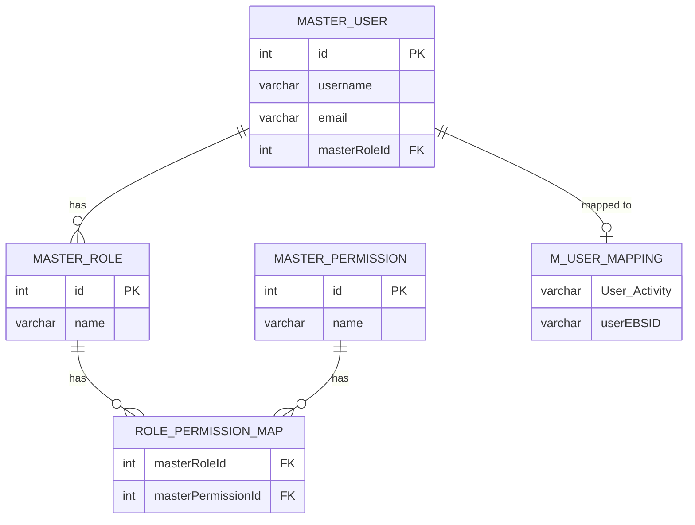

#### Flow Login User

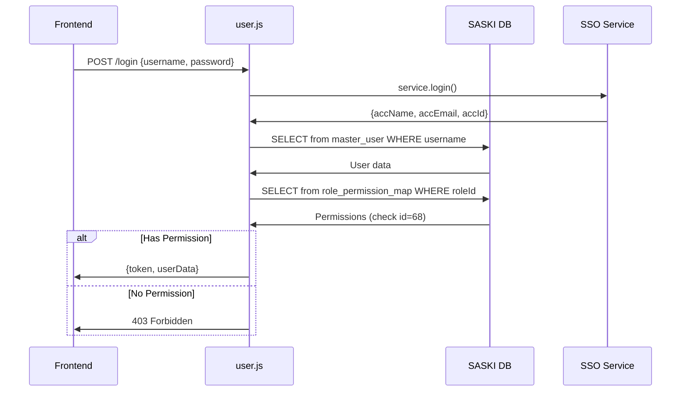

---

### 3.2. Dashboard Handler (`dashboardAAF.js`)

#### Stored Procedures yang Digunakan

| Stored Procedure                                           | Fungsi                            |
| ---------------------------------------------------------- | --------------------------------- |
| SP_APIHUB_ERPORACLE_AAF_ACCRUED_INDEX_LIST                 | List dokumen Accrued              |
| SP_APIHUB_ERPORACLE_AAF_ACCRUED_INDEX_LIST_COUNT           | Count dokumen Accrued             |
| SP_APIHUB_ERPORACLE_AAF_ACCRUED_INDEX_DETAIL               | Detail dokumen Accrued            |
| SP_APIHUB_ERPORACLE_AAF_ACTUAL_ACCRUED_INDEX_V3            | List Actual Accrued               |
| SP_APIHUB_ERPORACLE_AAF_ACTUAL_ACCRUED_INDEX_V3_COUNT      | Count Actual Accrued              |
| SP_APIHUB_ERPORACLE_AAF_ACTUAL_ACCRUED_INDEX_DETAIL_V3     | Detail Actual Accrued             |
| SP_APIHUB_ERPORACLE_AAF_ACTUAL_NON_ACCRUED_INDEX_V3        | List Actual Non Accrued           |
| SP_APIHUB_ERPORACLE_AAF_ACTUAL_NON_ACCRUED_INDEX_V3_COUNT  | Count Actual Non Accrued          |
| SP_APIHUB_ERPORACLE_AAF_ACTUAL_NON_ACCRUED_INDEX_DETAIL_V3 | Detail Actual Non Accrued         |
| SP_APIHUB_ERPORACLE_AAF_DASHBOARD_COUNT                    | Aggregated counts untuk dashboard |

#### Flow Dashboard Data

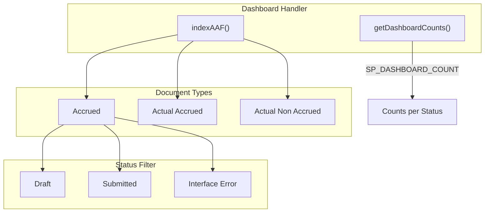

---

### 3.3. Invoice/Report Handler (`invoice.js`)

#### Stored Procedures dan Views

| SP/View                                                | Tipe        | Fungsi                                  |
| ------------------------------------------------------ | ----------- | --------------------------------------- |
| SP_APIHUB_ERPORACLE_AAF_ACCRUED_CHECK_KLICI_VALIDATION | SP          | Validasi KLICI untuk Accrued            |
| SP_APIHUB_ERPORACLE_AAF_CHECK_KLICI_ACTF               | SP          | Validasi KLICI untuk Actual Accrued     |
| SP_APIHUB_ERPORACLE_AAF_CHECK_KLICI_ANAF               | SP          | Validasi KLICI untuk Actual Non Accrued |
| XXGL_KICI_COMMERCIAL_INVOICE_V                         | Oracle View | Master data Commercial Invoice          |
| XXKI_SASKI_AAF_KLICI_AVAILABLE_ACTF_V                  | Oracle View | KLICI available untuk ACTF              |
| XXKI_SASKI_AAF_KLICI_AVAILABLE_ANAF_V                  | Oracle View | KLICI available untuk ANAF              |

#### Flow Validasi KLICI

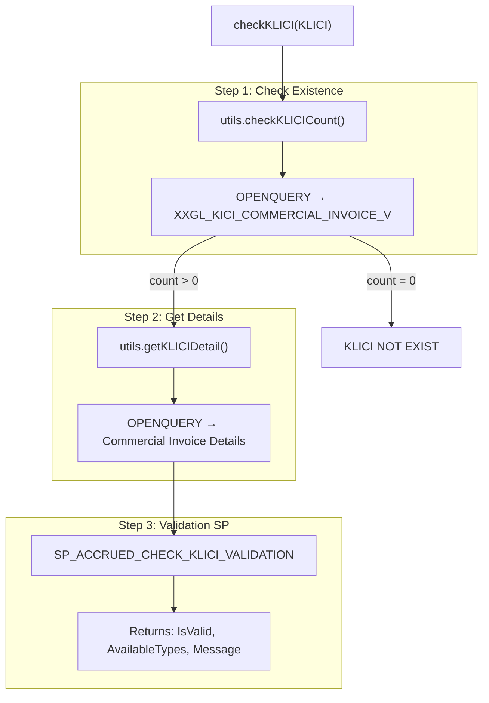

---

### 3.4. Supplier Handler (`supplier.js`)

#### Stored Procedures yang Digunakan

| Stored Procedure                            | Fungsi                                 |
| ------------------------------------------- | -------------------------------------- |
| SP_APIHUB_ERPORACLE_AAF_INDEX_APSUPPLIER_v2 | Get list supplier by Paid Country      |
| Dynamic OPENQUERY                           | Get Paid Country from Transaction Type |

#### Flow Get Suppliers by Transaction Type

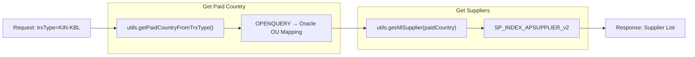

---

### 3.5. Accrued Handler (`accrued.js`)

#### Stored Procedures Utama

| Kategori   | Stored Procedure                                        | Fungsi                       |
| ---------- | ------------------------------------------------------- | ---------------------------- |
| **Header** | SP_APIHUB_ERPORACLE_AAF_ACCRUED_CREATE_HEADER           | Create header dokumen        |
| **Header** | SP_APIHUB_ERPORACLE_AAF_ACCRUED_INDEX_LIST              | List dokumen                 |
| **Header** | SP_APIHUB_ERPORACLE_AAF_ACCRUED_DELETE_HEADER           | Delete header                |
| **Detail** | SP_APIHUB_ERPORACLE_AAF_ACCRUED_INDEX_DETAIL            | Get detail lines             |
| **Detail** | SP_APIHUB_ERPORACLE_AAF_ACCRUED_DELETE_DETAIL           | Delete detail                |
| **Submit** | SP_APIHUB_ERPORACLE_AAF_ACCRUED_CREATE_JOURNAL          | Create GL journal via Oracle |
| **Status** | SP_APIHUB_ERPORACLE_AAF_ACCRUED_UPDATE_INTERFACE_STATUS | Update status interface      |

#### Alur Data Accrued

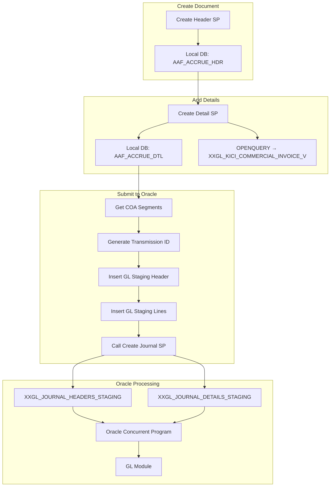

---

### 3.6. Actual Accrued Handler (`actual.js`)

#### Stored Procedures Utama

| Kategori   | Stored Procedure                                                  | Fungsi             |
| ---------- | ----------------------------------------------------------------- | ------------------ |
| **Header** | SP_APIHUB_ERPORACLE_AAF_ACTUAL_CREATE                             | Create header      |
| **Header** | SP_APIHUB_ERPORACLE_AAF_ACTUAL_ACCRUED_INDEX_V3                   | List header        |
| **Detail** | SP_APIHUB_ERPORACLE_AAF_ACTUAL_CREATE_DETAIL                      | Create detail      |
| **Detail** | SP_APIHUB_ERPORACLE_AAF_ACTUAL_ACCRUED_INDEX_DETAIL_V3            | Get detail         |
| **GL**     | SP_APIHUB_ERPORACLE_AAF_GL_CREATE_HEADER                          | Create GL staging  |
| **GL**     | SP_APIHUB_ERPORACLE_AAF_UPDATE_GL_STAGING_HEADER                  | Update GL staging  |
| **GL**     | SP_APIHUB_ERPORACLE_AAF_DELETE_GL_HEADER                          | Delete GL staging  |
| **AP**     | SP_APIHUB_ERPORACLE_AAF_AP_CREATE_HEADER                          | Create AP staging  |
| **Submit** | SP_APIHUB_ERPORACLE_AAF_POST_REVERSE_TO_EBS                       | Post to Oracle EBS |
| **Batch**  | SP_APIHUB_ERPORACLE_AAF_SAVE_BATCH_TRANSMISSION_TO_DETAIL_ACCRUED | Save batch info    |

#### Alur Submit Actual Accrued (Dual Interface)

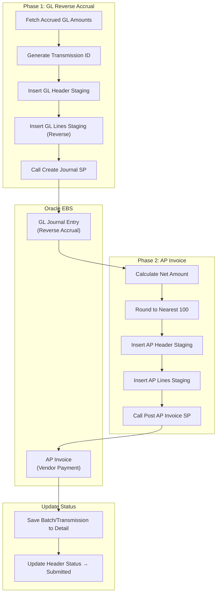

---

### 3.7. Actual Non Accrued Handler (`actualNonAccrued.js`)

#### Stored Procedures Utama

| Kategori   | Stored Procedure                                           | Fungsi                  |
| ---------- | ---------------------------------------------------------- | ----------------------- |
| **Header** | SP_APIHUB_ERPORACLE_AAF_ACTUAL_NON_ACCRUED_CREATE          | Create header           |
| **Header** | SP_APIHUB_ERPORACLE_AAF_ACTUAL_NON_ACCRUED_INDEX_V3        | List header             |
| **Detail** | SP_APIHUB_ERPORACLE_AAF_ACTUAL_NON_ACCRUED_CREATE_DETAIL   | Create detail           |
| **Detail** | SP_APIHUB_ERPORACLE_AAF_ACTUAL_NON_ACCRUED_INDEX_DETAIL_V3 | Get detail              |
| **AP**     | SP_APIHUB_ERPORACLE_AAF_UPDATE_AP_STAGING_HEADER           | Update AP staging       |
| **AP**     | SP_APIHUB_ERPORACLE_AAF_UPDATE_AP_STAGING_LINES            | Update AP staging lines |
| **Submit** | SP_APIHUB_ERPORACLE_AAF_POST_AP_NON_ACCRUE_TO_EBS          | Post to Oracle EBS      |
| **Batch**  | SP_APIHUB_ERPORACLE_AAF_SAVE_BATCH_NAME_TO_DETAIL          | Save batch info         |

#### Alur Submit Actual Non Accrued (AP Only)

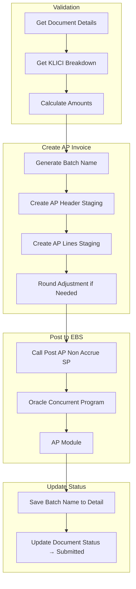

---

## 4. Oracle Views dan Fungsinya

### 4.1. Daftar Oracle Views

| View                                       | Lokasi | Fungsi                                   |
| ------------------------------------------ | ------ | ---------------------------------------- |
| XXGL_KICI_COMMERCIAL_INVOICE_V             | APPS   | Master data Commercial Invoice (KLICI)   |
| XXKI_SASKI_AAF_ACCRUE_DTL_V                | APPS   | Detail transaksi Accrued                 |
| XXKI_SASKI_AAF_ACTUAL_ACCRUE_DETAILS_V     | APPS   | Detail transaksi Actual Accrued          |
| XXKI_SASKI_AAF_ACTUAL_NON_ACCRUE_DETAILS_V | APPS   | Detail transaksi Actual Non Accrued      |
| XXKI_SASKI_AAF_KLICI_VALIDATION_V          | APPS   | Ringkasan validasi KLICI                 |
| XXKI_SASKI_AAF_KLICI_AVAILABLE_ACTF_V      | APPS   | KLICI available untuk Actual Accrued     |
| XXKI_SASKI_AAF_KLICI_AVAILABLE_ANAF_V      | APPS   | KLICI available untuk Actual Non Accrued |

### 4.2. Hubungan Antar Oracle Views

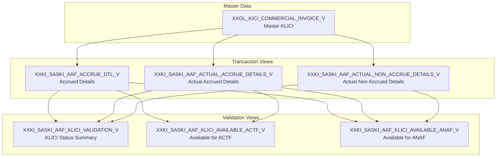

---

## 5. Staging Tables Oracle

### 5.1. GL Staging (Journal)

| Tabel                        | Schema | Fungsi                |
| ---------------------------- | ------ | --------------------- |
| XXGL_JOURNAL_HEADERS_STAGING | XKIN   | Header jurnal GL      |
| XXGL_JOURNAL_DETAILS_STAGING | XKIN   | Detail line jurnal GL |

### 5.2. AP Staging (Invoice)

| Tabel                  | Schema | Fungsi                 |
| ---------------------- | ------ | ---------------------- |
| XXAP_INVOICES_HDR_STG  | XKIN   | Header invoice AP      |
| XXAP_INVOICES_LINE_STG | XKIN   | Detail line invoice AP |

### 5.3. Flow Data ke Staging

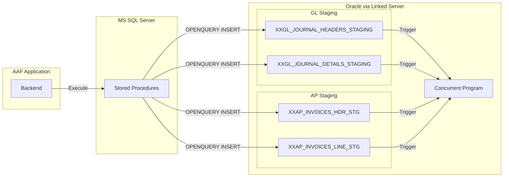

---

## 6. Ringkasan Stored Procedures

### 6.1. By Module

| Module             | Jumlah SP | Prefix                                        |
| ------------------ | --------- | --------------------------------------------- |
| Accrued            | 15+       | SP*APIHUB_ERPORACLE_AAF_ACCRUED*\*            |
| Actual Accrued     | 20+       | SP*APIHUB_ERPORACLE_AAF_ACTUAL*\*             |
| Actual Non Accrued | 15+       | SP*APIHUB_ERPORACLE_AAF_ACTUAL_NON_ACCRUED*\* |
| Dashboard          | 5+        | SP*APIHUB_ERPORACLE_AAF_DASHBOARD*\*          |
| Master             | 5+        | SP*APIHUB_ERPORACLE_AAF_INDEX*\*              |

### 6.2. Naming Convention

```
SP_APIHUB_ERPORACLE_AAF_[MODULE]_[ACTION]_[VERSION]

Contoh:
- SP_APIHUB_ERPORACLE_AAF_ACCRUED_CREATE_HEADER
- SP_APIHUB_ERPORACLE_AAF_ACTUAL_ACCRUED_INDEX_V3
- SP_APIHUB_ERPORACLE_AAF_CHECK_KLICI_ACTF
```

---

## 7. Referensi File

| Handler             | Path                                                                     |
| ------------------- | ------------------------------------------------------------------------ |
| accrued.js          | `saski-aaf-backend/src/routes/v1/handlers/transaction/accrued/`          |
| actual.js           | `saski-aaf-backend/src/routes/v1/handlers/transaction/actual/`           |
| actualNonAccrued.js | `saski-aaf-backend/src/routes/v1/handlers/transaction/actualNonAccrued/` |
| invoice.js          | `saski-aaf-backend/src/routes/v1/handlers/transaction/report/`           |
| freightReport.js    | `saski-aaf-backend/src/routes/v1/handlers/transaction/report/`           |
| supplier.js         | `saski-aaf-backend/src/routes/v1/handlers/master/`                       |
| user.js             | `saski-aaf-backend/src/routes/v1/handlers/master/`                       |
| dashboardAAF.js     | `saski-aaf-backend/src/routes/v1/handlers/dashboard/`                    |
| helpers.js          | `saski-aaf-backend/src/routes/v1/helpers/`                               |
