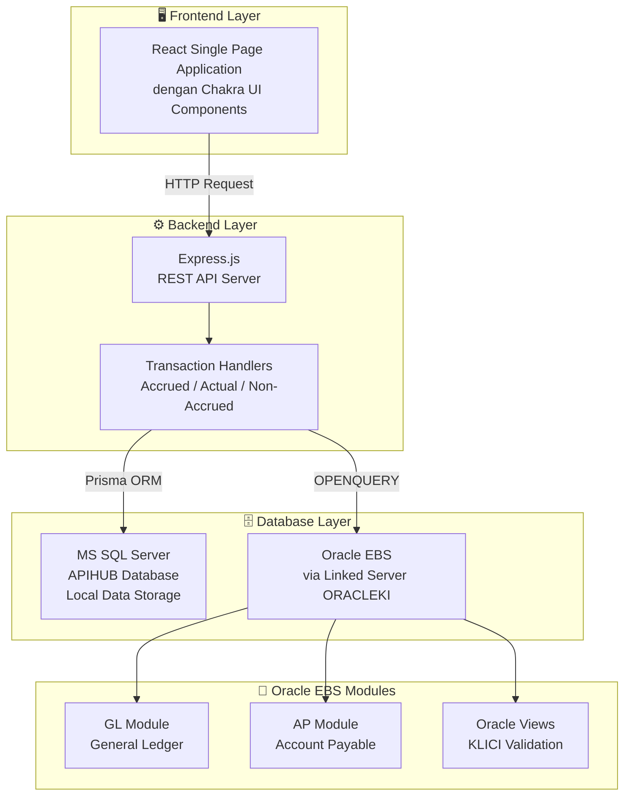
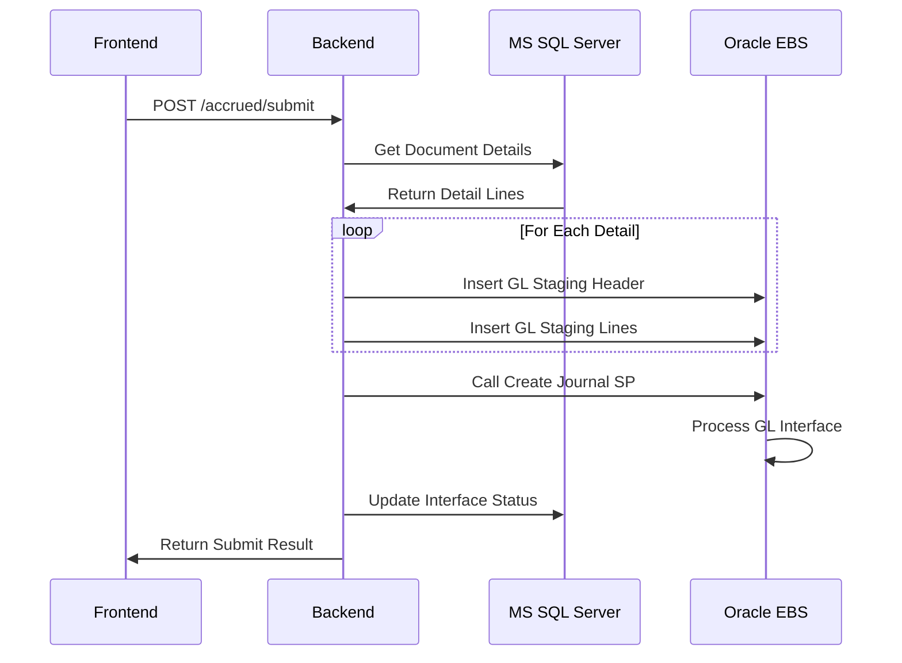
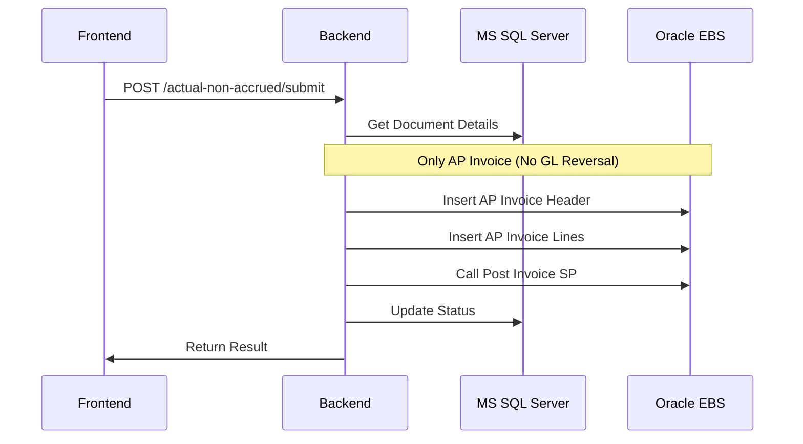
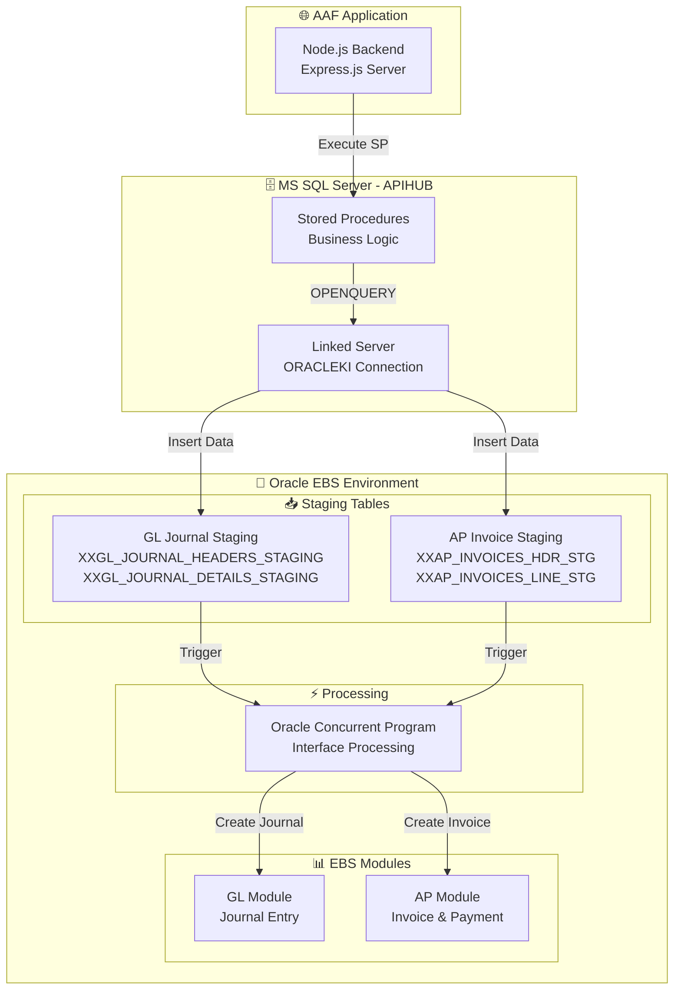

# Laporan Teknis Aplikasi AAF (Actual Accrued & Freight)

---

## 1. Pendahuluan

### 1.1. Tujuan Dokumen

Dokumen ini menyajikan penjelasan teknis mengenai aplikasi AAF (Actual Accrued & Freight) yang dikembangkan untuk mendukung proses pencatatan dan pelaporan biaya logistik dalam operasional perusahaan Kalbe. Dokumen ini disusun untuk keperluan laporan akhir kegiatan magang mahasiswa Informatika.

### 1.2. Gambaran Umum Aplikasi

Aplikasi AAF merupakan sistem informasi berbasis web yang terintegrasi dengan Oracle EBS (E-Business Suite) untuk mengelola transaksi biaya aktual terkait pengiriman barang eksport. Aplikasi ini berfungsi sebagai pemroses pencatatan biaya accrual (estimasi) dan biaya aktual yang terdiri dari dua kategori utama:

1. **Actual Accrued (ACTF)**: Transaksi biaya aktual yang telah memiliki jurnal accrual sebelumnya
2. **Actual Non Accrued (ANAF)**: Transaksi biaya aktual yang tidak memiliki jurnal accrual sebelumnya

Kedua jenis transaksi tersebut mencakup tipe biaya **Freight (F)**, **Trucking (T)**, dan **Trucking2 (T2)**.

---

## 2. Tujuan dan Fungsi Utama

### 2.1. Tujuan Aplikasi

1. **Sentralisasi Pencatatan Biaya Logistik**: Mengkonsolidasikan pencatatan biaya freight dan trucking dalam satu platform terintegrasi
2. **Validasi Data KLICI**: Memastikan kesesuaian data KLICI (Kalbe Logistic Invoice Commercial Invoice) dengan data master di Oracle EBS
3. **Integrasi dengan Oracle EBS**: Melakukan interface otomatis ke modul GL (General Ledger) dan AP (Account Payable) Oracle
4. **Audit Trail**: Menyediakan jejak audit lengkap untuk setiap transaksi yang diproses

### 2.2. Fungsi Utama

| Fungsi            | Deskripsi                                                                                |
| ----------------- | ---------------------------------------------------------------------------------------- |
| Pencatatan Accrue | Mencatat estimasi biaya berdasarkan Commercial Invoice sebelum invoice aktual diterima   |
| Reversal Accrue   | Melakukan jurnal pembalik untuk Accrue yang sudah tercatat saat biaya aktual terealisasi |
| Pencatatan Actual | Mencatat biaya aktual berdasarkan invoice dari vendor logistik                           |
| Validasi KLICI    | Memeriksa ketersediaan dan eligibilitas KLICI untuk transaksi tertentu                   |
| Interface ke EBS  | Mengirimkan data ke staging table Oracle untuk diproses oleh EBS Concurrent Program      |

---

## 3. Arsitektur Sistem

### 3.1. Arsitektur High-Level



### 3.2. Komponen Sistem

#### 3.2.1. Frontend (saski-aaf-frontend)

| Teknologi        | Versi  | Fungsi                                        |
| ---------------- | ------ | --------------------------------------------- |
| React            | 18.x   | Library UI untuk membangun antarmuka pengguna |
| Vite             | 7.x    | Build tool dan development server             |
| Chakra UI        | 2.10.x | Component library untuk konsistensi UI        |
| Redux Toolkit    | 1.9.x  | State management untuk data aplikasi          |
| React Router DOM | 6.21.x | Client-side routing                           |
| Axios            | 1.4.x  | HTTP client untuk komunikasi API              |
| ExcelJS          | 4.4.x  | Library untuk export/import data Excel        |

**Struktur Direktori Frontend:**

```
saski-aaf-frontend/src/
├── routes/Transaction/
│   ├── Accrued/
│   │   ├── AccruedHeaderList.jsx
│   │   ├── AccruedDetail.jsx
│   │   └── AccruedHeaderUpload.jsx
│   ├── ActualAccrued/
│   │   ├── ActualAccruedHeaderList.jsx
│   │   ├── ActualAccruedDetail.jsx
│   │   └── ActualAccruedHeaderUpload.jsx
│   └── ActualNonAccrued/
│       ├── ActualNonAccruedHeaderList.jsx
│       ├── ActualNonAccruedDetail.jsx
│       └── ActualNonAccruedHeaderUpload.jsx
├── backend/                 # API service layer
├── components/              # Reusable UI components
└── app/                     # Redux store configuration
```

#### 3.2.2. Backend (saski-aaf-backend)

| Teknologi       | Versi  | Fungsi                                           |
| --------------- | ------ | ------------------------------------------------ |
| Node.js         | 20.x   | Runtime JavaScript server-side                   |
| Express.js      | 4.18.x | Web framework untuk REST API                     |
| Prisma          | 5.22.x | ORM untuk akses database MS SQL Server           |
| ODBC            | 2.4.x  | Driver untuk koneksi ke Oracle via Linked Server |
| Multer          | 1.4.x  | Middleware untuk file upload                     |
| XLSX            | 0.18.x | Library untuk parsing file Excel                 |
| Moment-timezone | 0.5.x  | Library untuk manajemen tanggal dan timezone     |
| Zod             | 4.0.x  | Schema validation library                        |

**Struktur Direktori Backend:**

```
saski-aaf-backend/src/
├── routes/v1/handlers/transaction/
│   ├── accrued/
│   │   └── accrued.js           # Handler modul Accrue
│   ├── actual/
│   │   └── actual.js            # Handler modul Actual Accrued
│   ├── actualNonAccrued/
│   │   └── actualNonAccrued.js  # Handler modul Actual Non Accrued
│   └── report/
│       └── invoice.js           # Handler untuk laporan
├── db/                          # Database configuration
└── config/                      # Application configuration
```

#### 3.2.3. Database Layer

**MS SQL Server (APIHUB)**

- Menyimpan data transaksi lokal (header dan detail dokumen)
- Menyimpan konfigurasi aplikasi
- Menampung Stored Procedures untuk logika bisnis

**Oracle EBS (via Linked Server ORACLEKI)**

- Staging tables untuk interface GL dan AP
- Views untuk validasi data KLICI
- Master data Commercial Invoice

---

## 4. Modul dan Fitur Utama

### 4.1. Modul Accrue (Estimasi Biaya)

#### 4.1.1. Deskripsi

Modul Accrue digunakan untuk mencatat estimasi biaya freight dan trucking berdasarkan Commercial Invoice yang diterima. Pencatatan dilakukan sebelum invoice aktual dari vendor logistik diterima.

#### 4.1.2. Proses Bisnis

1. **Create Document**: Membuat dokumen accrue baru dengan nomor format `ACCF/YYYY/MM/NNN`
2. **Add Detail**: Menambahkan baris detail dengan informasi KLICI, supplier, currency, dan amount
3. **Submit**: Mengirimkan data ke Oracle GL Staging untuk pembuatan jurnal accrual
4. **Interface Check**: Memantau status interface ke Oracle EBS

#### 4.1.3. Fungsi Handler Backend (`accrued.js`)

| Fungsi                  | HTTP Method | Endpoint                 | Deskripsi                                       |
| ----------------------- | ----------- | ------------------------ | ----------------------------------------------- |
| `index`                 | GET         | `/accrued`               | Mengambil daftar dokumen accrue dengan paginasi |
| `create`                | POST        | `/accrued/create`        | Membuat dokumen accrue baru                     |
| `indexDetail`           | GET         | `/accrued/:docId`        | Mengambil detail dokumen accrue                 |
| `createDetail`          | POST        | `/accrued/detail/add`    | Menambah baris detail                           |
| `updateDetail`          | PUT         | `/accrued/detail/update` | Memperbarui baris detail                        |
| `dropDetail`            | DELETE      | `/accrued/detail/drop`   | Menghapus baris detail                          |
| `submit`                | POST        | `/accrued/submit`        | Submit dokumen ke Oracle GL                     |
| `syncStatusFromStaging` | GET         | `/accrued/sync/:docId`   | Sinkronisasi status dari Oracle                 |

#### 4.1.4. Alur Submit Accrue



---

### 4.2. Modul Actual Accrued (ACTF)

#### 4.2.1. Deskripsi

Modul Actual Accrued digunakan untuk mencatat biaya aktual yang telah memiliki jurnal accrue sebelumnya. Proses ini melibatkan **reversal** jurnal accrue dan pembuatan **AP Invoice** untuk pembayaran ke vendor.

#### 4.2.2. Prasyarat Validasi KLICI

Sebuah KLICI dapat digunakan untuk Actual Accrued jika:

1. KLICI terdaftar dalam `XXGL_KICI_COMMERCIAL_INVOICE_V`
2. Memiliki record Accrue dengan status `INTERFACE SUCCESS`
3. Belum memiliki record Actual Accrued aktif (atau status `CANCELLED`)

#### 4.2.3. Tipe Biaya yang Didukung

| Type           | Deskripsi                        | Validasi Khusus                                          |
| -------------- | -------------------------------- | -------------------------------------------------------- |
| F (Freight)    | Biaya pengiriman via kapal/udara | -                                                        |
| T (Trucking)   | Biaya trucking primer            | -                                                        |
| T2 (Trucking2) | Biaya trucking sekunder          | Tidak boleh menggunakan supplier yang sama dengan Type T |

#### 4.2.4. Fungsi Handler Backend (`actual.js`)

| Fungsi                      | HTTP Method | Endpoint                                     | Deskripsi                       |
| --------------------------- | ----------- | -------------------------------------------- | ------------------------------- |
| `index`                     | GET         | `/actual`                                    | Daftar dokumen actual accrued   |
| `create`                    | POST        | `/actual/create`                             | Membuat dokumen baru            |
| `indexDetail`               | GET         | `/actual/:docId`                             | Detail dokumen                  |
| `createDetail`              | POST        | `/actual/detail/add`                         | Tambah detail                   |
| `updateDetail`              | PUT         | `/actual/detail/update`                      | Update detail                   |
| `submitActual`              | POST        | `/actual/submit`                             | Submit ke Oracle GL & AP        |
| `checkKLICIActualAccrued`   | GET         | `/actual/check-klici/:klici`                 | Validasi KLICI                  |
| `checkInvoiceActualAccrued` | GET         | `/actual/check-invoice`                      | Validasi Invoice Number         |
| `getAccruedGLAmounts`       | GET         | `/actual/accrued-gl-amounts/:transmissionId` | Ambil amount dari jurnal accrue |

#### 4.2.5. Alur Submit Actual Accrued

```mermaid
sequenceDiagram
    participant FE as Frontend
    participant BE as Backend
    participant SQL as MS SQL Server
    participant ORA as Oracle EBS

    FE->>BE: POST /actual/submit
    BE->>SQL: Get Document Details
    BE->>ORA: Fetch Accrued GL Amounts

    Note over BE,ORA: Phase 1: GL Reverse Accrual
    BE->>ORA: Insert GL Staging (Reverse Entry)
    BE->>ORA: Call Create Journal SP

    Note over BE,ORA: Phase 2: AP Invoice Creation
    BE->>ORA: Insert AP Invoice Header
    BE->>ORA: Insert AP Invoice Lines
    BE->>ORA: Call Post Invoice SP

    BE->>SQL: Update Status
    BE->>FE: Return Result
```



#### 4.2.6. Oracle View untuk Validasi KLICI ACTF

View `XXKI_SASKI_AAF_KLICI_AVAILABLE_ACTF_V` menyediakan data validasi dengan field:

| Field                | Deskripsi                                        |
| -------------------- | ------------------------------------------------ |
| KICI                 | Kode KLICI                                       |
| ALLOWED_TYPES        | Tipe yang tersedia (F, T, T2, atau kombinasinya) |
| F_AVAILABLE          | Status ketersediaan Type F (Y/N)                 |
| T_AVAILABLE          | Status ketersediaan Type T (Y/N)                 |
| T2_AVAILABLE         | Status ketersediaan Type T2 (Y/N)                |
| T2_RESTRICTED_SUPPID | Supplier ID yang tidak boleh digunakan untuk T2  |
| F_TRANSMISSION_ID    | Transmission ID dari jurnal Accrue Type F        |
| T_TRANSMISSION_ID    | Transmission ID dari jurnal Accrue Type T        |

---

### 4.3. Modul Actual Non Accrued (ANAF)

#### 4.3.1. Deskripsi

Modul Actual Non Accrued digunakan untuk mencatat biaya aktual yang **tidak memiliki** jurnal accrue sebelumnya. Proses ini hanya melibatkan pembuatan **AP Invoice** tanpa reversal GL.

#### 4.3.2. Prasyarat Validasi KLICI

Sebuah KLICI dapat digunakan untuk Actual Non Accrued jika:

1. **Tidak memiliki** record Accrue, ATAU
2. Memiliki Accrue tetapi Actual Accrued-nya sudah berstatus `CANCELLED`
3. Belum memiliki record Actual Non Accrued aktif

#### 4.3.3. Fungsi Handler Backend (`actualNonAccrued.js`)

| Fungsi                       | HTTP Method | Endpoint                                 | Deskripsi            |
| ---------------------------- | ----------- | ---------------------------------------- | -------------------- |
| `index`                      | GET         | `/actual-non-accrued`                    | Daftar dokumen       |
| `create`                     | POST        | `/actual-non-accrued/create`             | Membuat dokumen baru |
| `indexDetail`                | GET         | `/actual-non-accrued/:docId`             | Detail dokumen       |
| `createDetail`               | POST        | `/actual-non-accrued/detail/add`         | Tambah detail        |
| `submitActualNonAccrued`     | POST        | `/actual-non-accrued/submit`             | Submit ke Oracle AP  |
| `checkKLICIActualNonAccrued` | GET         | `/actual-non-accrued/check-klici/:klici` | Validasi KLICI       |

#### 4.3.4. Alur Submit Actual Non Accrued



---

## 5. Struktur Database

### 5.1. Tabel Lokal MS SQL Server

#### 5.1.1. Tabel Header Dokumen

```sql
-- Contoh struktur tabel header (simplified)
CREATE TABLE AAF_ACTUAL_HEADERS (
    ID INT PRIMARY KEY IDENTITY,
    DOCNUMBER VARCHAR(50) NOT NULL,
    DOCTYPE VARCHAR(50) DEFAULT 'Actual',
    STATE VARCHAR(20) DEFAULT 'Draft',
    METHOD VARCHAR(20) DEFAULT 'Input',
    CREATEDBY VARCHAR(100),
    CREATEDDATE DATETIME DEFAULT GETDATE()
);
```

#### 5.1.2. Tabel Detail Dokumen

```sql
-- Contoh struktur tabel detail (simplified)
CREATE TABLE AAF_ACTUAL_DETAILS (
    ID INT PRIMARY KEY IDENTITY,
    DOCNUMBER VARCHAR(50) NOT NULL,
    KICI VARCHAR(50) NOT NULL,
    TYPEFT VARCHAR(5) NOT NULL,  -- F, T, T2
    SUPPID VARCHAR(50),
    SUPPNAME VARCHAR(200),
    CURRENCY VARCHAR(10),
    AMOUNT DECIMAL(18,2),
    INVOICENO VARCHAR(100),
    COUNTRYNAME VARCHAR(100),
    STATUS_INTERFACE_GL VARCHAR(50),
    STATUS_INTERFACE_AP VARCHAR(50),
    TRANSMISSION_ID VARCHAR(50),
    BATCH_NAME VARCHAR(100)
);
```

### 5.2. Oracle Views

#### 5.2.1. XXKI_SASKI_AAF_KLICI_VALIDATION_V

View ini menyediakan ringkasan status validasi KLICI untuk semua tipe transaksi:

```sql
-- Contoh query penggunaan
SELECT KICI, CUSTOMER_NAME, COUNTRY_NAME,
       HAS_ACCRUE_F, HAS_ACCRUE_T,
       HAS_ACTUAL_ACCRUED_F, HAS_ACTUAL_ACCRUED_T,
       HAS_ACTUAL_NON_ACCRUED_F, HAS_ACTUAL_NON_ACCRUED_T
FROM APPS.XXKI_SASKI_AAF_KLICI_VALIDATION_V
WHERE KICI = 'KICI123456';
```

#### 5.2.2. XXKI_SASKI_AAF_KLICI_AVAILABLE_ACTF_V

View khusus untuk validasi ketersediaan KLICI pada modul Actual Accrued.

#### 5.2.3. XXKI_SASKI_AAF_KLICI_AVAILABLE_ANAF_V

View khusus untuk validasi ketersediaan KLICI pada modul Actual Non Accrued.

### 5.3. Stored Procedures Utama

| Stored Procedure                                       | Database | Fungsi                                   |
| ------------------------------------------------------ | -------- | ---------------------------------------- |
| SP_APIHUB_ERPORACLE_AAF_ACCRUED_CREATE_HEADER          | MS SQL   | Membuat header dokumen Accrue            |
| SP_APIHUB_ERPORACLE_AAF_ACTUAL_ACCRUED_INDEX_V3        | MS SQL   | Query list dokumen Actual Accrued        |
| SP_APIHUB_ERPORACLE_AAF_ACTUAL_ACCRUED_INDEX_DETAIL_V3 | MS SQL   | Query detail dokumen dengan data staging |
| SP_APIHUB_ERPORACLE_AAF_GL_CREATE_HEADER               | MS SQL   | Insert ke Oracle GL Staging Header       |
| SP_APIHUB_ERPORACLE_AAF_POST_REVERSE_TO_EBS            | MS SQL   | Trigger Oracle concurrent program        |
| SP_APIHUB_ERPORACLE_AAF_POST_AP_NON_ACCRUE_TO_EBS      | MS SQL   | Post AP Invoice untuk Non Accrued        |

---

## 6. Integrasi dengan Oracle EBS

### 6.1. Arsitektur Integrasi



### 6.2. Staging Tables

#### 6.2.1. GL Staging (Journal)

- `XKIN.XXGL_JOURNAL_HEADERS_STAGING`: Header jurnal
- `XKIN.XXGL_JOURNAL_DETAILS_STAGING`: Detail line jurnal

#### 6.2.2. AP Staging (Invoice)

- `XKIN.XXAP_INVOICES_HDR_STG`: Header invoice
- `XKIN.XXAP_INVOICES_LINE_STG`: Detail line invoice

### 6.3. Status Interface

| Status                      | Deskripsi                               |
| --------------------------- | --------------------------------------- |
| NEW                         | Data baru disubmit, menunggu proses     |
| PROCESSED                   | Sedang diproses oleh concurrent program |
| INTERFACED                  | Berhasil diproses, menunggu validasi    |
| SUCCESS / INTERFACE SUCCESS | Berhasil ter-interface ke EBS           |
| ERROR / INTERFACE ERROR     | Gagal, perlu penanganan manual          |
| CANCELLED                   | Dibatalkan                              |

---

## 7. Alur Penggunaan dari Sudut Pandang Pengguna

### 7.1. Skenario: Membuat Transaksi Actual Accrued

**Prasyarat**: User telah login dan memiliki akses ke modul Actual Accrued

**Langkah-langkah:**

1. **Akses Halaman List**

   - User mengakses menu **Transaction > Actual Accrued**
   - Sistem menampilkan daftar dokumen milik user

2. **Buat Dokumen Baru**

   - User klik tombol **Create New**
   - Sistem membuat dokumen dengan nomor format `ACTF/2025/12/001`
   - User diarahkan ke halaman detail

3. **Tambah Detail Transaksi**

   - User klik tombol **Add Detail**
   - Sistem menampilkan form input
   - User mengisi:
     - **KLICI**: Sistem melakukan auto-search dan validasi
     - **Type**: Memilih F (Freight), T (Trucking), atau T2
     - **Supplier**: Memilih dari dropdown
     - **Invoice No**: Nomor invoice vendor
     - **Currency & Amount**: Mata uang dan nominal

4. **Validasi KLICI**

   - Sistem memeriksa ketersediaan KLICI melalui Oracle View
   - Jika valid, form dapat disubmit
   - Jika tidak valid, sistem menampilkan pesan error

5. **Submit Dokumen**

   - User klik tombol **Submit**
   - Sistem melakukan:
     - Validasi semua baris detail
     - Insert ke GL Staging (reversal)
     - Insert ke AP Staging (invoice)
     - Trigger concurrent program
   - User dapat memantau status interface

6. **Monitoring Status**
   - User dapat melihat status per-baris:
     - GL Status: NEW → INTERFACING → SUCCESS/ERROR
     - AP Status: NEW → INTERFACING → SUCCESS/ERROR

### 7.2. Skenario: Upload Bulk Data

1. User download template Excel dari sistem
2. User mengisi data sesuai format
3. User klik **Upload** dan memilih file
4. Sistem melakukan validasi:
   - Format kolom
   - Ketersediaan KLICI
   - Duplikasi data
5. User mereview hasil validasi
6. User submit data yang valid

---

## 8. Peran Aplikasi dalam Proses Bisnis

### 8.1. Dalam Proses Finance

| Proses              | Peran AAF                                             |
| ------------------- | ----------------------------------------------------- |
| Accrual Recording   | Mencatat estimasi biaya logistik pada akhir periode   |
| Expense Recognition | Mencatat biaya aktual berdasarkan invoice vendor      |
| Accrual Reversal    | Mem-reverse jurnal accrual saat biaya aktual tercatat |
| Vendor Payment      | Menyediakan data AP Invoice untuk pembayaran          |

### 8.2. Dalam Proses Supply Chain

| Proses                 | Peran AAF                                    |
| ---------------------- | -------------------------------------------- |
| Shipment Cost Tracking | Tracking biaya per Commercial Invoice        |
| Vendor Performance     | Data untuk evaluasi kinerja vendor logistik  |
| Cost Analysis          | Data untuk analisis biaya freight & trucking |

### 8.3. Dalam Proses Reporting

| Laporan                | Data Source dari AAF                    |
| ---------------------- | --------------------------------------- |
| Monthly Accrual Report | Data jurnal accrual per periode         |
| Freight Cost Analysis  | Data biaya freight per customer/country |
| Vendor Payment Report  | Data invoice yang perlu dibayar         |

---

## 9. Kesimpulan

Aplikasi AAF merupakan sistem terintegrasi yang menghubungkan proses pencatatan biaya logistik dengan Oracle EBS. Dengan arsitektur modern berbasis web (React + Node.js) dan integrasi database multi-tier (MS SQL Server + Oracle), aplikasi ini menyediakan:

1. **Efisiensi Proses**: Otomatisasi interface ke Oracle mengurangi pekerjaan manual
2. **Validasi Data**: Pre-validation terhadap KLICI sebelum transaksi dibuat
3. **Tracking Status**: Monitoring real-time status interface ke Oracle
4. **Audit Trail**: Pencatatan lengkap pembuat dan waktu transaksi

Pengembangan lebih lanjut dapat mencakup penambahan fitur reporting yang lebih komprehensif dan integrasi dengan modul Oracle lainnya.

---

## Lampiran

### A. Daftar Teknologi dan Versi

| Komponen            | Teknologi     | Versi |
| ------------------- | ------------- | ----- |
| Frontend Runtime    | Node.js       | 20.x  |
| Frontend Framework  | React         | 18.2  |
| Frontend Build Tool | Vite          | 7.x   |
| Frontend UI Library | Chakra UI     | 2.10  |
| Backend Runtime     | Node.js       | 20.x  |
| Backend Framework   | Express.js    | 4.18  |
| Backend ORM         | Prisma        | 5.22  |
| Local Database      | MS SQL Server | 2019  |
| ERP Database        | Oracle        | 19c   |

### B. Referensi File Kode

| Modul                      | File                                         | Path                                                                     |
| -------------------------- | -------------------------------------------- | ------------------------------------------------------------------------ |
| Accrue Handler             | accrued.js                                   | `saski-aaf-backend/src/routes/v1/handlers/transaction/accrued/`          |
| Actual Accrued Handler     | actual.js                                    | `saski-aaf-backend/src/routes/v1/handlers/transaction/actual/`           |
| Actual Non Accrued Handler | actualNonAccrued.js                          | `saski-aaf-backend/src/routes/v1/handlers/transaction/actualNonAccrued/` |
| KLICI Validation View      | 06_XXKI_SASKI_AAF_KLICI_VALIDATION_V.sql     | `database/ORACLE_VIEW/`                                                  |
| ACTF Available View        | 07_XXKI_SASKI_AAF_KLICI_AVAILABLE_ACTF_V.sql | `database/ORACLE_VIEW/`                                                  |
| ANAF Available View        | 08_XXKI_SASKI_AAF_KLICI_AVAILABLE_ANAF_V.sql | `database/ORACLE_VIEW/`                                                  |
